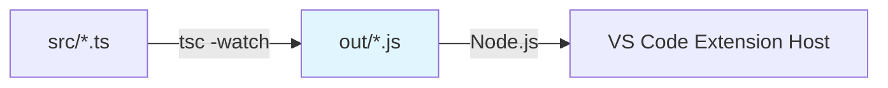

# 构建架构详解：双编译器策略

本项目采用了 **TypeScript Compiler (tsc)** 和 **esbuild** 并存的“双编译器”策略。这在现代 VS Code 插件开发中是一种高效且流行的架构模式。

## 1. 架构总览

| 场景 | 使用工具 | 核心命令 | 目的 | 输出产物 |
| :--- | :--- | :--- | :--- | :--- |
| **开发调试 (Dev)** | **tsc** | `npm run watch` | 增量编译、类型检查、源码调试 | `out/` 目录下保留文件结构的 JS 文件 |
| **生产打包 (Prod)** | **esbuild** | `npm run esbuild` | 极速打包、代码混淆、Tree Shaking | `out/extension.js` 单文件 bundle |

## 2. 为什么需要两个工具？

你可能会问：“既然 esbuild 那么快，为什么不全用 esbuild？” 或者 “既然 tsc 是官方的，为什么打包要换工具？”

### 2.1 开发阶段：TypeScript Compiler (tsc) 的优势

*   **类型检查**：`tsc` 是唯一能提供完整 TypeScript 类型检查的工具。`esbuild` 只做转译（移除类型），不检查类型错误。
*   **调试友好**：
    *   `tsc` 编译出的文件结构与源码目录（`src/`）一一对应。
    *   `out/extension.js` 引用 `out/webview/iconfont.js`，逻辑清晰。
    *   配合 Source Map，在 VS Code 中断点调试非常稳定。
*   **增量编译**：`tsc -watch` 模式非常成熟，能精准感知文件变化。

> **配置验证**：
> 查看 `.vscode/launch.json`，你会发现 `preLaunchTask` 指向 `npm: watch`，这证实了我们在按 F5 调试时使用的是 `tsc`。

### 2.2 生产阶段：esbuild 的优势

*   **极速打包**：`esbuild` 使用 Go 语言编写，打包速度比 Webpack/Rollup 快 10-100 倍。
*   **单文件捆绑 (Bundling)**：
    *   它将项目代码和所有依赖（`node_modules`）打包进一个单独的 `extension.js` 文件。
    *   **优点**：显著减少插件体积，加快插件启动速度（减少了大量磁盘 I/O 操作，不需要加载成百上千个小文件）。
*   **代码压缩 (Minification)**：
    *   自动移除空格、注释，缩短变量名（这就导致了之前遇到的 `Sp` 构造函数问题）。
    *   进一步减小体积，保护源码。

## 3. 工作流示意图

### 开发流程 (Debug)

*   `out` 目录结构 = `src` 目录结构。
*   依赖保留在 `node_modules` 中，运行时实时 `require`。

### 发布流程 (Release)
```mermaid
graph LR
    A[src/*.ts] -- esbuild --bundle --> B[out/extension.js]
    B -- vsce package --> C[extension.vsix]
    style B fill:#ffe0b2
```
*   `out` 目录仅包含极少数文件（`extension.js`）。
*   依赖被“内联”进了 `extension.js`，不再依赖外部 `node_modules`。

## 4. 常见陷阱

正因为这种双轨制，容易出现 **“开发没问题，上线就报错”** 的情况（Works on my machine）：

1.  **CommonJS 兼容性**：如之前的 `adm-zip` 问题。`tsc` 对 CJS 兼容性较好，而 `esbuild` 严格遵循 ESM 规范。
2.  **动态 Require**：如果代码中有 `require('./' + variable)` 这种动态引用，`esbuild` 无法静态分析打包，会导致运行时找不到模块；而 `tsc` 模式下因为文件都在磁盘上，可能恰好能跑通。

## 5. 最佳实践

*   **保持一致性**：尽量使用标准的导入导出语法。
*   **发布前测试**：
    *   不要只依赖 F5 调试。
    *   在发布前，务必运行 `npm run esbuild` 生成打包文件。
    *   使用 `Extension Development Host` 加载打包后的 `out/extension.js` 进行一轮冒烟测试。

